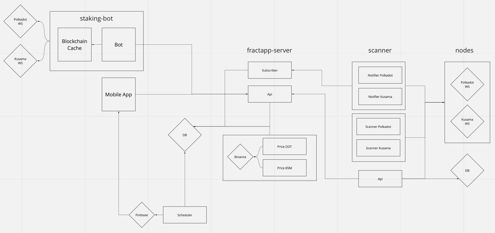

## Architecture


The architecture has multiple modules

#### fractapp-server consists of:
```
api - profile keeper and main api for the client
```
```
subscriber - receives data about new transactions from scanner
```
```
price - saves the price of a coin to the database
``` 
```
scheduler - turns on every 1 minute to send notifications through firebase
``` 

#### scanner consists of:
```
api - blockchain api which is responsible for receiving transactions, information about transactions, etc.
```
```
scanner - scans transactions from the blockchain and writes to the database
```
```
notifier - notifies fractapp-server of new transactions
``` 

#### staking-bot consists of:
```
cache - caches data from the blockchain so that the staking-bot can quickly receive it
```
```
bot - staking bot that sends and receives messages via fractapp-server api
```


